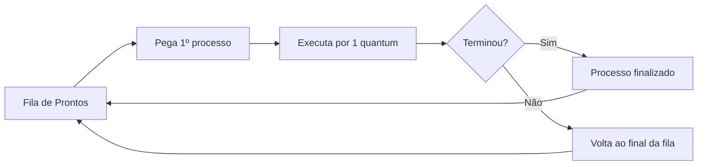

# 🔄 Simulador Round Robin - Escalonamento de Processos

[](https://github.com)
[](https://python.org)
[](https://pt.wikipedia.org/wiki/Round_robin_(ci%C3%AAncia_da_computa%C3%A7%C3%A3o))

> ⚡ **"Justiça no compartilhamento da CPU, um quantum de cada vez!"**

---

# 🎯 Visão Geral

Este projeto implementa uma **simulação didática** do algoritmo de escalonamento **Round Robin (RR)**, um dos mais importantes e justos algoritmos utilizados em sistemas operacionais modernos.

## 📊 Cenário Simulado

| Processo | Tempo Total (ut*) | Quantum |
|----------|-------------------|---------|
| **P1**   | 10 unidades       | 2 ut    |
| **P2**   | 5 unidades        | 2 ut    |
| **P3**   | 8 unidades        | 2 ut    |

> *ut = unidades de tempo (ex: milissegundos, ticks de CPU)

---

# 🧠 Como Funciona o Round Robin?



## 🔑 Características Principais

| Característica | Descrição |
|---|---|
| 🎪 Alternância Cíclica | Processos se revezam em uma fila circular |
| ⏲️ Preemptivo | Processo é interrompido após o quantum |
| ⚖️ Justo | Todos recebem a mesma fatia de tempo |
| 📱 Responsivo | Ideal para sistemas interativos |

---

# 🚀 Executando a Simulação

## Pré-requisitos

- Python 3.x instalado
- Nenhuma biblioteca externa necessária!

## Passo a Passo

```bash
# 1. Clone ou baixe o arquivo
# 2. Execute o programa
python round_robin.py
```

---

# 📺 Exemplo de Saída

```text
=============================================
      SIMULAÇÃO - ROUND ROBIN
      Quantum = 2 unidades de tempo
=============================================

--- Ciclo 1 ---
Fila atual: P1(10)  P2(5)  P3(8)

  Executando : P1
  Tempo usado: 2 unidade(s)
  Restante   : 8 unidade(s)
  ↩ P1 volta para o final da fila.

--- Ciclo 2 ---
Fila atual: P2(5)  P3(8)  P1(8)

  Executando : P2
  Tempo usado: 2 unidade(s)
  Restante   : 3 unidade(s)
  ↩ P2 volta para o final da fila.

... (continua até todos finalizarem)
```

---

# 📈 Resultados da Simulação

## ⏱️ Linha do Tempo de Execução

```text
Ciclo:   1    2    3    4    5    6    7    8    9   10   11   12
─────────────────────────────────────────────────────────────────
P1      ██         ██         ██         ██         ██      ██
P2           ██         ██         ██    █
P3                ██         ██         ██         ██    █
─────────────────────────────────────────────────────────────────
ut:     2    4    6    8   10   12   14   16   18   20   22   23

Legenda:
██ = execução (2ut)
█  = execução final (1ut)
```

---

# 🏁 Ordem de Finalização

1. 🥇 P2
2. 🥈 P3
3. 🥉 P1

---

# 📊 Estatísticas Finais

```text
┌─────────────────────────────────────────────┐
│          RESULTADOS FINAIS                  │
├─────────────────────────────────────────────┤
│ ⏱️  Tempo total       │ 23 unidades         │
│ 🔄 Ciclos executados  │ 12                  │
│ 🔁 Trocas de contexto │ 11                  │
│ ⚡ Quantum usado      │ 2 unidades          │
│ 📋 Processos finais   │ 3/3                 │
└─────────────────────────────────────────────┘
```

---

# 🎮 Parâmetros que Você Pode Alterar

## 🔄 Mudando o Quantum

```python
# Experimente diferentes valores!
QUANTUM = 4  # Quantum maior → menos trocas de contexto
QUANTUM = 1  # Quantum menor → mais responsividade
```

## ➕ Adicionando Novos Processos

```python
processos = [
    {"nome": "P1", "restante": 10},
    {"nome": "P2", "restante": 5},
    {"nome": "P3", "restante": 8},
    {"nome": "P4", "restante": 3},  # ← Novo processo!
]
```

---

# 🧪 Experimentos para Fazer

| Experimento | O que observar | Quantum sugerido |
|---|---|---|
| 🐢 Quantum muito grande | Comporta-se como FCFS | 100 |
| 🐇 Quantum muito pequeno | Muitas trocas de contexto | 1 |
| ⚖️ Processos equilibrados | Alternância perfeita | 5 |
| 📊 Processo muito longo | Não causa starvation | 2-4 |

---

# 📚 Conceitos Teóricos Abordados

## ✅ O que você aprende com este código

- Round Robin — Funcionamento prático do algoritmo
- Fila circular — Estrutura de dados utilizada
- Preempção — Processo perde CPU forçadamente
- Troca de contexto — Alternância entre processos
- Quantum — Parâmetro crítico do escalonador

---

# 🔬 Comparação com Outros Algoritmos

| Algoritmo | Preemptivo? | Justo? | Complexidade |
|---|---|---|---|
| FIFO/FCFS | ❌ | ⭐⭐ | Baixa |
| SJF | ⚠️* | ⭐⭐⭐ | Média |
| Round Robin | ✅ | ⭐⭐⭐⭐⭐ | Média |
| Priority | ✅ | ⭐⭐ | Alta |

> *SJF pode ser preemptivo ou não

---

# 🛠️ Estrutura do Código

```text
round_robin.py
├── 📋 Configuração dos processos
├── ⚙️ Definição do QUANTUM
├── 🔧 Função round_robin()
│   ├── 📥 Criação da fila
│   ├── 🔄 Loop principal
│   ├── 📊 Controle de tempo
│   └── ✅ Finalização
└── 🚀 Execução principal
```

---

# 💡 Dicas de Estudo

- Execute passo a passo com um debugger para ver a fila mudando
- Desenhe o diagrama da fila após cada ciclo
- Calcule manualmente antes de executar e compare
- Mude o quantum para valores extremos (1 e 100)
- Adicione um processo I/O-bound (simule com `input()`)

---

# 🎓 Aplicações no Mundo Real

| Sistema | Uso do Round Robin |
|---|---|
| 🖥️ Linux | CFS (Completely Fair Scheduler) é similar |
| 🍎 macOS | Baseado em RR com prioridades |
| 🎮 Jogos | Alternância entre processos de áudio/vídeo |
| 📱 Android | Escalonamento de apps em segundo plano |

---

# 📖 Referências

- Round Robin Scheduling - Wikipedia
- Operating System Concepts (Silberschatz)
- Modern Operating Systems (Tanenbaum)

---

# 🤝 Contribuições

Sinta-se à vontade para:

- 🐛 Reportar bugs
- 💡 Sugerir melhorias
- 🔧 Adicionar novas funcionalidades
  - Tempo de espera
  - Turnaround time
  - Métricas avançadas

---

# 📝 Licença

Este projeto é open source e pode ser utilizado para fins educacionais.

---

# ⭐ Mostre seu apoio

Se este material te ajudou a entender Round Robin, dê uma ⭐ no repositório!

---

## 🎓 Desenvolvido para a disciplina de DESENVOLVER SIMULADOR DE ABSTRAÇÕES DE RECURSOS DE S.O
